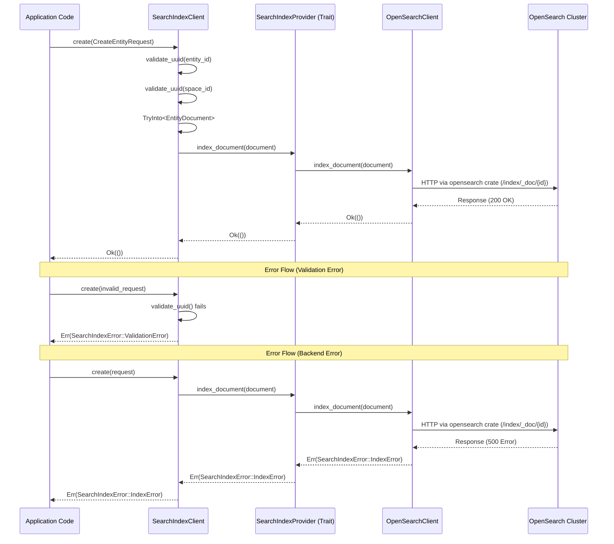

# Search Indexer Repository Architecture

## Sequence Diagram



## Layered Overview

```
┌─────────────────────────────────────────────────────────────────┐
│                        Application Code                         │
│  - Uses SearchIndexClient for all operations                    │
│  - Handles SearchIndexError                                     │
└────────────────────────────┬────────────────────────────────────┘
                             │
                             ▼
┌─────────────────────────────────────────────────────────────────┐
│                    SearchIndexClient                            │
│  - Validates input (UUIDs, batch sizes)                         │
│  - Converts requests to EntityDocument                          │
│  - Delegates operations to SearchIndexProvider                  │
│  - Returns SearchIndexError                                     │
└────────────────────────────┬────────────────────────────────────┘
                             │
                             ▼
┌─────────────────────────────────────────────────────────────────┐
│                SearchIndexProvider (Trait)                      │
│  - Abstract backend interface                                   │
│  - Methods: index_document, update_document, delete_document    │
│    + bulk_index_documents, bulk_update, bulk_delete             │
│  - Returns SearchIndexError                                     │
└────────────────────────────┬────────────────────────────────────┘
                             │
                             │ Implementation
                             ▼
┌─────────────────────────────────────────────────────────────────┐
│                  OpenSearchClient                               │
│  - Implements SearchIndexProvider                               │
│  - Makes calls to an OpenSearch cluster using the opensearch    │
│    Rust crate for all REST calls                                │
│  - Handles index configuration and OpenSearch-specific logic    │
│  - Converts errors from opensearch crate to SearchIndexError    │
└────────────────────────────┬────────────────────────────────────┘
                             │
                             ▼
┌─────────────────────────────────────────────────────────────────┐
│                   OpenSearch Cluster                            │
│  - OpenSearch server                                            │
│  - Stores and indexes documents                                 │
│  - Returns HTTP responses                                       │
└─────────────────────────────────────────────────────────────────┘
```

## Component Responsibilities

### SearchIndexClient
- **Input validation**: UUID format, required fields, batch size limits
- **Request conversion**: CreateEntityRequest → EntityDocument
- **Error handling**: All errors are SearchIndexError
- **Configuration**: Batch size limits, etc.

### SearchIndexProvider (Trait)
- **Abstract interface**: Defines contract for all backend implementations
- **Operation methods**: CRUD and bulk operations
- **Error type**: Returns SearchIndexError for all operations

### OpenSearchClient
- **Implements SearchIndexProvider**: Concrete backend implementation
- **HTTP communication**: All calls to OpenSearch cluster are performed using the [opensearch Rust crate](https://docs.rs/opensearch/)
- **Error conversion**: Translates OpenSearch errors into SearchIndexError
- **Index management**: Handles index creation, aliases, etc.

## Error Flow

All errors propagate as `SearchIndexError` through each layer:

```
OpenSearch Cluster Error
    ↓
OpenSearchClient (converts to SearchIndexError)
    ↓
SearchIndexProvider (passes through)
    ↓
SearchIndexClient (passes through)
    ↓
Application Code (handles SearchIndexError)
```

## Example Data Flow: Creating a Document

```
1. Application: create(CreateEntityRequest { entity_id: "123", ... })
   ↓
2. SearchIndexClient: Validates UUIDs, converts to EntityDocument
   ↓
3. SearchIndexProvider: index_document(&EntityDocument)
   ↓
4. OpenSearchClient: Makes HTTP request to OpenSearch using opensearch crate
   ↓
5. OpenSearch: Stores document, returns 200 OK
   ↓
6. Response flows back: Ok(()) → Application
```

